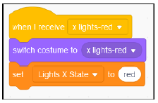

# Create code blocks to set the ‘Lights X State’ variable

a) Select the **Lights X** sprite

b) Using blocks in the **Looks** & **Variables** sections set the initial costume and **Lights X State** variable to ‘off’ when the Green flag is clicked

c) Use a broadcast message to set the costume and **Lights X State** variable to ‘red’

* Using the **when I receive** block in the Events section create a new message called ‘x lights-red’:

* Now set the costume and **Lights X State** variable to ‘red’:

d) Repeat the step above to create similar broadcast message blocks for the other 3 costumes and states:

e) You can test your code by clicking on each of the 5 code sections in turn. You should see the lights change to the relevant colour. If you show the Lights X State variable on the stage by ticking the box next to the variable you should also see the text change as well.

&nbsp;&nbsp;

Click the arrow to see the complete code for the <b>Lights X</b> sprite

 

Now we have to write similar code for the **Lights Y** sprite:

[Create Code for 'Lights Y State' variable](../03-LightsYState/README.md)
