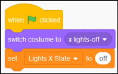

# Create code blocks to set the ‘Lights X State’ variable

a) Select the **Lights X** sprite

b) Using blocks in the **Looks & Variables** sections set the initial costume and **Lights X State** variable to ‘off’ when the Green flag is clicked

c) Use a broadcast message to set the costume and **Lights X State** variable to ‘red’

* Using the **when I receive** block in the Events section create a new message called ‘Lights X-red’:

