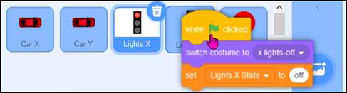
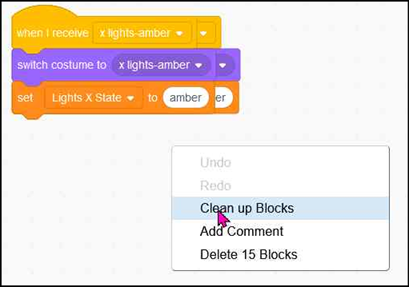
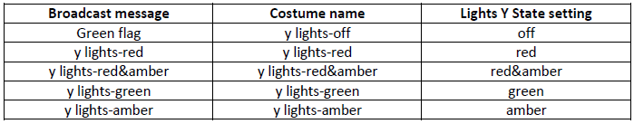
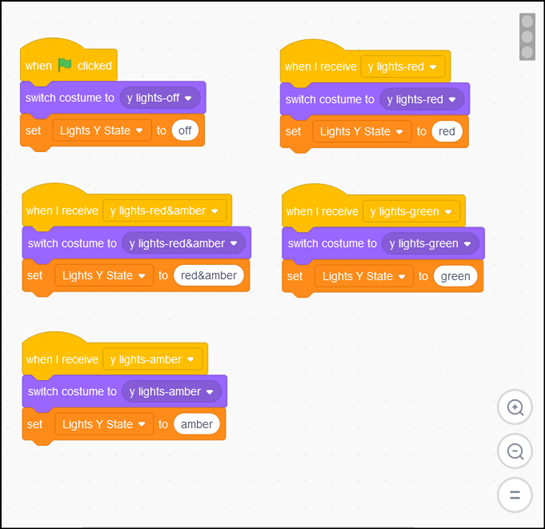

# Create code blocks to set the ‘Lights Y State’ variable

We could create code on the **Lights Y** sprite as we did above for the **Lights X** sprite.   Alternatively we can use the facility in Scratch to drag and drop code from one sprite to another.   We can then edit the new copied code as required.

a) Click on one of the code sections in the **Lights X** sprite with the left mouse button and hold the button down.  Drag the code section over the icon for the **Lights Y** sprite.  When the **Lights Y** sprite ‘wiggles’ release the left mouse button:

b) Repeat the ‘drag and drop’ for the other 4 code sections

c) Select the **Lights Y** sprite

d) The code sections may be sitting on top of each other.  To sort them out, right-mouse click on the white background to show a pop-up menu, then choose **Clean up Blocks**

e) Edit the code sections to:

• respond to new messages specific for the **Lights Y** sprite

• refer to the costumes for the **Lights Y** sprite

• set the **Lights Y State** variable

f) You can test your code by clicking on each of the 5 code sections in turn.  You should see the lights change to the relevant colour.   If you show the **Lights Y State** variable on the stage by ticking the box next to the variable you should also see the text change as well.

Click the arrow to see the complete code for the <b>Lights Y</b> sprite

 

Next we have to [Define the Traffic Light sequences](../04-Sequences/README.md)
