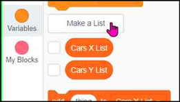
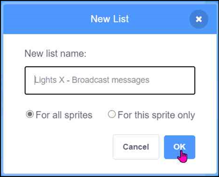
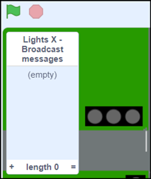
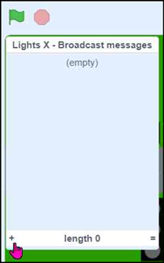
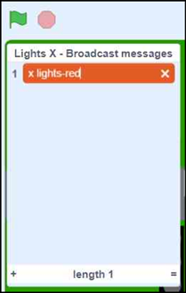
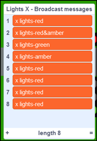
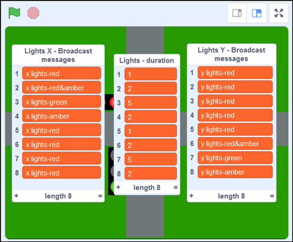

# Define the Traffic Light sequences

The sequence required for the two sets of traffic lights is shown by 8 states as in this table.  The coloured circles indicate the light that should be displayed for the corresponding time as specified in the 3rd column.

We will set up these sequences using 3 Scratch Lists:

• **Lights X - Broadcast messages**, contains the ordered list of broadcast messages for the cars moving horizontally

• **Lights Y - Broadcast messages**, contains the ordered list of broadcast messages for the cars moving vertically

• **Lights - Duration**, contains the ordered list of durations that the lights remain in each state

## Lights X Sequence

a) Using the **Make a List** option in the **Variables** section to create a new list called **Lights X - Broadcast messages**.  We want other sprites to able to read this list so make sure you choose the **For all sprites** option.

&nbsp;&nbsp;

b) You should see an empty list in the Stage area.  The list can be made wider by using the mouse to drag the bottom right corner of the list down and to the right.

&nbsp;&nbsp;

c) Add the name of the first broadcast message corresponding to red light on the Lights X sprite. (We created the broadcast messages in step 2 - Create code blocks to set the ‘Lights X State’ variable.) To do this click on the little + in the bottom left of the list, then type the name of the first broadcast message into the box. 

&nbsp;&nbsp;

d) Repeat the previous step to add the other 7 broadcast messages.   Your list should now look like the screen shot below:

## Lights Y Sequence

Repeat the above steps to create a list for the other set of lights, **Lights Y - Broadcast messages**. It will be similar to the list you’ve just created but not the same. Use the chart at the top of this page to help you decide which order to add the items to the list.

## Lights - Duration Sequence

Using similar methods now create a **Lights - Duration** list using the values in the **Duration** column in the chart above.

Click the arrow to see what all the populated lists should look like

 

Next we have to [Program the Light sequences](../05-ProgramSequences/README.md)
