# Program the Light Sequence

We will create the code for making the lights run through their sequences on the **Start Button** sprite.   The light sprites change according to **broadcast** messages that they receive.  The messages to be sent are contained in **Lights X - Broadcast messages** and **Lights Y - Broadcast** messages lists that we created in the last section.   The **Duration** list contains the amount of time we want to wait between each message being broadcast. The basic steps are:

1. Broadcast message from **1st** item in the **Lights X - Broadcast messages** list
2. Broadcast message from **1st** item in the Lights Y- Broadcast messages list
3. Wait for time of **1st** item in the **Duration** list
4. Broadcast message from **2nd** item in the **Lights X - Broadcast messages** list
5. Broadcast message from **2nd** item in the **Lights Y - Broadcast messages** list
6. Wait for time of **2nd** item in the **Duration** list
7. ….
8. ….
9. ….
10.	Broadcast message from **8th** item in the **Lights X - Broadcast messages** list
11.	Broadcast message from **8th** item in the **Lights Y - Broadcast messages** list
12.	Wait for time of **8th** item in the **Duration** list

## Initialise the Start Button

Using the **Show** block in the **Looks** section add the code to show the **Start Button** when the **Green Flag** is clicked.

## Add a Block for the sequence code

We’ll put all the code for running the sequence into a Block. We will only call the Block once, so it isn’t entirely necessary, but it does clearly show what this part of the code is doing.

a) Create new Block called **Run Sequence**

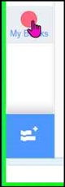&nbsp;&nbsp;
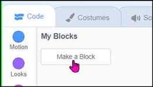

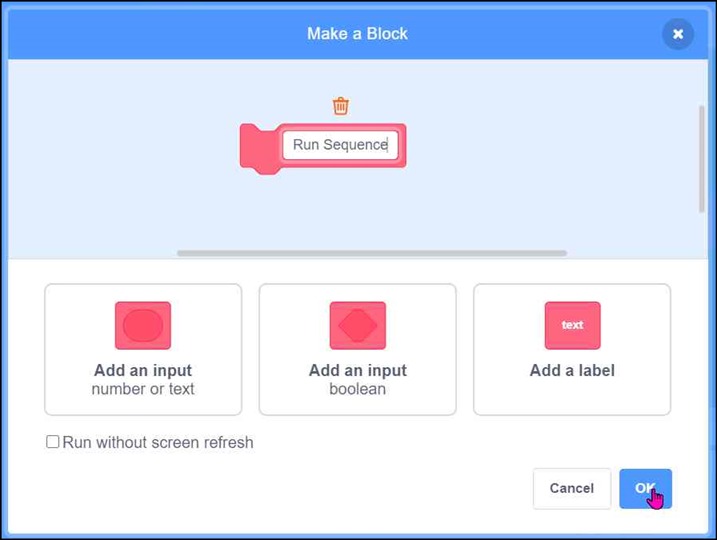

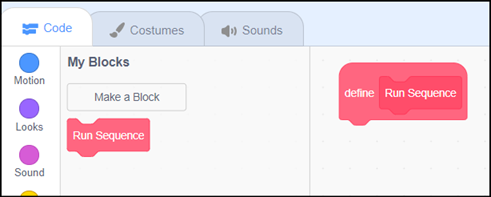

b) We need to create loop that repeats for the number of items in one of the **Broadcast messages** lists.     We know that this is 8.   Another way to get the number of items in a list will be to use the **length** of block in the **Variables** section:

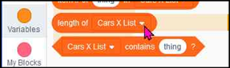

c) We have created the lists to be all the same length so it doesn’t matter which one we use. The **repeat** loop should look like this:

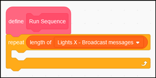

d) We need a way to reference the items in the lists.  We’ll do this using a variable.

• Create a new variable called **count**. It only needs to be available to this sprite

• Initialise it to zero outside the repeat loop and increment it by 1 inside the loop

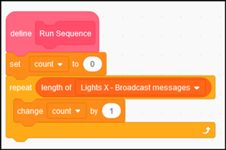

e) Also included in the **Variables** blocks is a block to obtain the data from a specific row of a **List**. The following will obtain the **1st** item of the **Lights X - Broadcast messages** list, i.e “x lights-red”

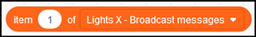

and this block will obtain the **6th** item of the Lights - **Duration** list, i.e “2”

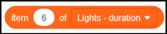

In place of actual numbers we need to use the **count** variable, so the above blocks will look like this

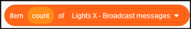

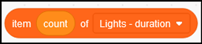

This will broadcast a message for the text contained in item count of the **Lights X - Broadcast messages** list
 
and this will wait for the number of seconds contained in item count of the Lights - **Duration** list
 
f)	Based on the information above, now add three blocks of code underneath the change count block, but inside the repeat loop.   These blocks should
•	Broadcast a message for item count from the **Lights X - Broadcast messages** list
•	Broadcast a message for item count from the **Lights Y - Broadcast messages** list
•	Wait for item count from the Lights - **Duration** list
g)	The above steps will run through the traffic light sequence once.   To make it repeat the sequence continuously add a forever block from the Control section.   All the code under the define block needs to be enclosed inside the forever loop. 
h)	When you’ve finished check your work by taking a look at page 15 for a screen shot showing all the code for the Start Button sprite. 
Action when clicking the Start  Button
a)	Use the event when this sprite is clicked and add the code to hide the Start Button 
b)	Next, add the call to the Run Sequence block
 
c)	When you’ve finished check your work by taking a look at page 15 for a screen shot showing all the code for the Start Button sprite. 
