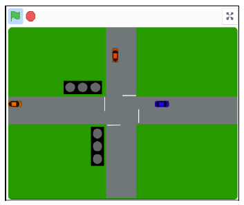
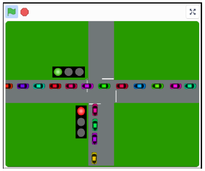

# Scratch project to control traffic flow with traffic lights

In this SCRATCH project you will program a set of traffic lights that will control the flow of cars at crossroads. This is a follow on from the *Traffic Lights for Scratch* project completed by the Wokingham Library Online Code Club in November 2020. 

You can find details of that project, including links to Youtube videos of the sessions, at this link:

* [Traffic Lights for Scratch](../../../OnlineCodeclub/blob/master/traffic_lights.md)

## Description of project

When you open the Starter project you’ll see the layout of a crossroads with two sets of traffic lights, which aren’t yet working.

If you click the green flag you’ll see cars start ‘driving’ from left to right & from bottom to top. You might see some near misses!

The task of this project is to add code to the traffic lights in order that the traffic is controlled. i.e. cars will queue when the lights are at red, will slow down when the lights are at amber and will only ‘go’ when the lights are at green, as illustrated in this screen capture.

## Download your copy of these instructions

If you would like to download your own copy of these instructions in a pdf document click the link below, and then click the Download button in the new window that opens:

[Traffic_Lights_Crossroads_and_Cars.pdf](Traffic_Lights_Crossroads_and_Cars.pdf)

## Let's get started

Now go to the instructions for the [Starter Project](01-Starter_project/README.md).
